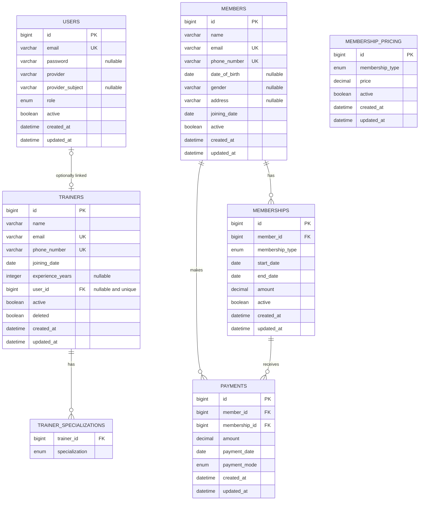
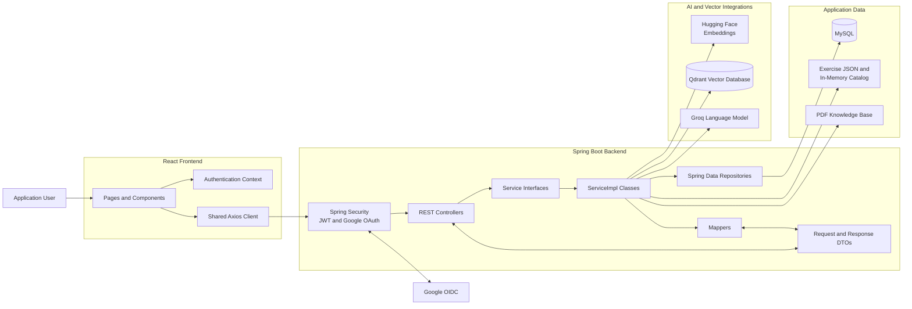

# FitManager Architecture Diagrams

This document represents the existing FitManager implementation. It describes the relational data model and the high-level relationships between application components without proposing an architectural redesign.

## Entity Relationship Diagram

### ERD Notes

- `BaseEntity` is a mapped superclass providing common identifier and timestamp fields. It does not have its own table.
- `Membership` owns its relationship to `Member` through `member_id`.
- `Payment` owns its relationships to both `Member` and `Membership`.
- `Trainer` optionally owns a one-to-one association with `User` through a nullable, unique `user_id`.
- Trainer specializations are stored in an element-collection table. They are not represented by a separate JPA entity.
- `MembershipPricing` has no database foreign-key relationship with `Membership`. They are associated through the `MembershipType` business value.
- `Exercise` is not a persisted JPA entity. Exercise data is loaded from JSON and therefore does not belong in the relational ERD.
- Qdrant collections are excluded because they are vector-storage structures rather than relational database tables.

## High-Level Component Relationship Diagram

### Component Notes

- The frontend communicates with the backend through the existing shared Axios client.
- Authentication state is managed within the frontend authentication context.
- Spring Security protects backend requests and handles JWT and Google OAuth/OIDC authentication.
- Controllers define the HTTP boundary and delegate work through service interfaces.
- Each service interface is implemented by its corresponding `ServiceImpl`, preserving the project's established separation of concerns.
- Service implementations coordinate business logic, mapping, repositories, and integrations.
- Repositories provide persistence access to MySQL.
- Exercise recommendations use the JSON-backed exercise catalogue and vector-related integrations.
- The personal assistant uses PDF knowledge, embeddings, Qdrant retrieval, and the Groq language model.
- Individual controllers, services, repositories, DTOs, and methods are intentionally omitted to keep this an architectural overview rather than a class-level dependency diagram.
